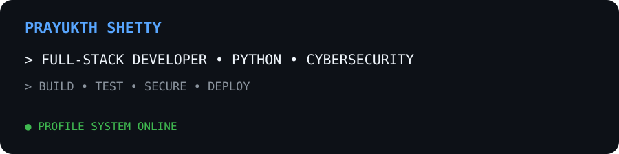
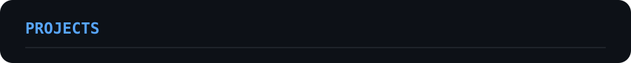
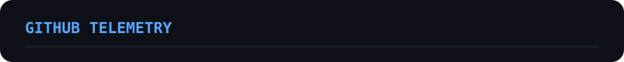
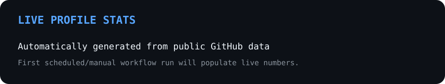
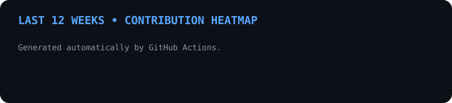
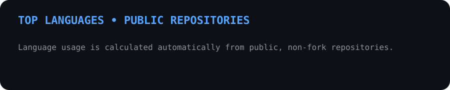
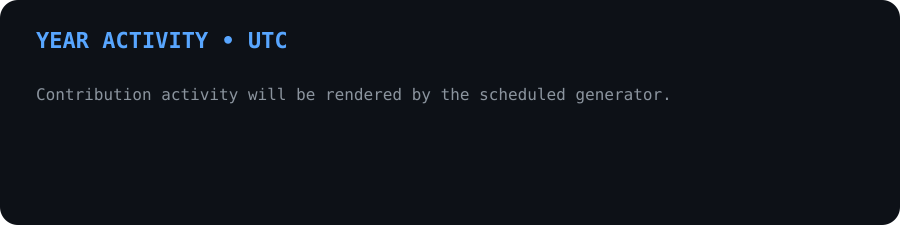
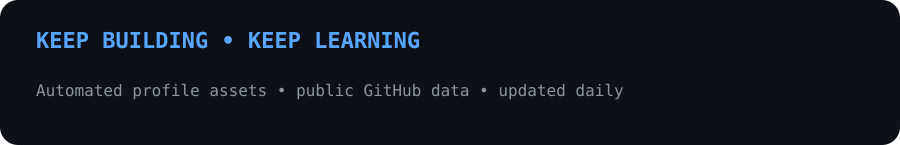

<div align="center">




<br>


</div>

---


I’m **Prayukth Shetty**, a Computer Science diploma student focused on **Python, full-stack development and cybersecurity**.

I like turning ideas into working software, understanding how systems work underneath, and continuously improving projects through testing, debugging and secure engineering.

```text
$ whoami
prayukthshetty

$ mission
BUILD • TEST • SECURE • DEPLOY

$ mindset
ALWAYS_LEARNING ████████████████████
```

---


<div align="center">


</div>

### Current learning

```text
PYTHON / OOP          ████████████████████  ACTIVE
FULL-STACK            ██████████████████░░  BUILDING
CYBERSECURITY         ███████████████░░░░░  DEVELOPING
JAVASCRIPT / TYPESCRIPT ██████████████░░░░░  EXPANDING
LINUX / NETWORKING    █████████████░░░░░░░  LEARNING
JAVA / C              ████████████░░░░░░░░  EXPANDING
```

---



### ⚡ AUCTO-BIDZONE

[](https://github.com/epicdventurer900/AUCTO-BIDZONE)

A full-stack auction platform focused on **authentication, role-based workflows, auction management, bidding logic and modern web architecture**.

**Stack:** Python • FastAPI • PostgreSQL • SQLAlchemy • React • TypeScript

> This profile repository only links to AUCTO-BIDZONE. Its source code is not modified by the profile automation.

---



<div align="center">



<br>



<br>



<br>



</div>

---

## `> system_pipeline`

```text
┌────────┐    ┌────────┐    ┌────────┐
│  IDEA  │ -> │  CODE  │ -> │  BUILD │
└────────┘    └────────┘    └───┬────┘
                                 │
                                 v
                           ┌──────────┐
                           │   TEST   │
                           └────┬─────┘
                                │
                                v
                           ┌──────────┐
                           │  SECURE  │
                           └────┬─────┘
                                │
                                v
                           ┌──────────┐
                           │  DEPLOY  │
                           └──────────┘
```

---

## `> automation`

The profile assets are generated automatically from **public GitHub data** by GitHub Actions.

- Runs daily at **05:17 UTC**
- Can also be started manually with **Run workflow**
- Uses whole UTC days for deterministic contribution data
- Aggregates public, non-fork repositories
- Commits generated SVGs only when something actually changes
- Uses no changes to **AUCTO-BIDZONE**

---

<div align="center">

<a href="https://github.com/epicdventurer900"></a>
<a href="https://github.com/epicdventurer900?tab=repositories"></a>

<br><br>



</div>
